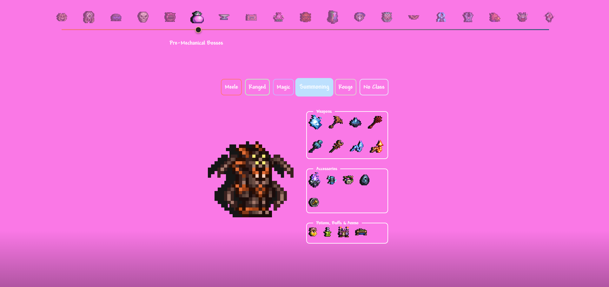

# Classamity

A fast and clean UI for the **Terraria** mod **Calamity** builds.

## Contributing
Help is only needed with the guide, for that only the `data.json` should be edited in the `/src` directory.

Pull request that edit something else wont be pulled!

New items or small changes can be recommended in the `Guide Changes` Issue.

<details>
  <summary>Editing <b>data.json</b></summary>
This is the main database of the website. Contains the game stages in them the classes and for each class weapons, armors, accessories, buffs and more.

### How to contribute?
- Fork the repository
- Run the `python` scripts in the `/src` directory called `addItem`, `removeItem`
- Fill in the asked fields and the updates should appear in `data.json`
- Create a **Pull request**
</details>

<details>
  <summary>Editing <b>combos.json</b></summary>
  This file contains items that really go well together. When an item is hovered their companion items light up.

- Fork the repository
- Open `combos.json`
  ```json
  {
    "combos": [
        {
            "items": ["Bee Gun", "Hive Pack", "Stinger Necklace"]
        },
        {
            "items": ["Item1", "Item2", "Item3"]
        },
        ...
    ]
  }
  ```
- Create a **Pull request**
</details>




